<!-- ╔══════════════════════════════════════════════════════════════════╗ -->
<!-- ║  GITHUB PROFILE README — Alexxfromgit · Gothic / Crimson edition  ║ -->
<!-- ╚══════════════════════════════════════════════════════════════════╝ -->

<!-- ───────────────  CUSTOM ANIMATED HERO  ─────────────── -->
<p align="center">
  <a href="https://github.com/Alexxfromgit">
    
  </a>
</p>

<!-- ───────────────  ANIMATED TAGLINE  ─────────────── -->
<p align="center">
  <a href="https://github.com/Alexxfromgit">
    
  </a>
</p>

<!-- ───────────────  PROFILE BADGES  ─────────────── -->
<p align="center">
  
  
  
  
</p>

<!-- ───────────────  SECTION DIVIDER  ─────────────── -->
<p align="center"></p>

## &nbsp;✦&nbsp;&nbsp;About&nbsp;Me

<table>
<tr>
<td valign="top" width="62%">

```yaml
👤  identity:    Alexander
💼  role:        Software Engineer
🏢  company:     Big Deals
🌍  origin:      Ukraine 🇺🇦
🎯  focus:
      - Infrastructure Automation
      - Configuration Management (SaltStack)
      - Bash & Shell Scripting
      - Virtualization · libvirt · cloud-init
🌱  studying:    Cloud Native · Kubernetes · IaC
💬  ask_about:   [Linux, SaltStack, Bash, Virtualization]
⚡  philosophy:  "automate it once — never again"
```

</td>
<td valign="top" width="38%" align="center">


<br><br>

<sub><i>"Infrastructure should be invisible —<br>until it isn't. My job is to keep it invisible."</i></sub>

</td>
</tr>
</table>

<!-- ───────────────  SECTION DIVIDER  ─────────────── -->
<p align="center"></p>

## &nbsp;✦&nbsp;&nbsp;Tech&nbsp;Stack

<table align="center">
<tr>
  <td valign="top" width="50%">

#### &nbsp;✦&nbsp;&nbsp;Languages & Scripting
<p>
  
  
  
  
  
</p>

#### &nbsp;✦&nbsp;&nbsp;Operating Systems
<p>
  
  
  
  
  
</p>

  </td>
  <td valign="top" width="50%">

#### &nbsp;✦&nbsp;&nbsp;DevOps & Infrastructure
<p>
  
  
  
  
  
</p>

#### &nbsp;✦&nbsp;&nbsp;Virtualization & Tools
<p>
  
  
  
  
  
</p>

  </td>
</tr>
</table>

<!-- ───────────────  SECTION DIVIDER  ─────────────── -->
<p align="center"></p>

## &nbsp;✦&nbsp;&nbsp;GitHub&nbsp;in&nbsp;Numbers

<p align="center">
  <a href="https://github.com/Alexxfromgit">
    
  </a>
  <a href="https://github.com/Alexxfromgit">
    
  </a>
</p>

<p align="center">
  <a href="https://github.com/Alexxfromgit">
    
  </a>
  <a href="https://github.com/Alexxfromgit">
    
  </a>
</p>

<p align="center">
  <a href="https://github.com/Alexxfromgit">
    
  </a>
</p>

<p align="center">
  <a href="https://github.com/Alexxfromgit">
    
  </a>
</p>

<p align="center">
  
</p>

<!-- ───────────────  SECTION DIVIDER  ─────────────── -->
<p align="center"></p>

## &nbsp;✦&nbsp;&nbsp;Featured&nbsp;Projects

<table>
<tr>
  <td width="50%" valign="top">
    <h4>🜂&nbsp; <a href="https://github.com/Alexxfromgit/DevOps_Salt_formula_users">Salt Formula · User Control</a></h4>
    <p>Salt formula for centralised user management across controlled host machines — provision, update, and revoke users at scale.</p>
    <p>
      
      
    </p>
  </td>
  <td width="50%" valign="top">
    <h4>🜃&nbsp; <a href="https://github.com/Alexxfromgit/DevOps_Bash_Script_For_SysInfo_Collection">SysInfo Collector</a></h4>
    <p>Bash script that gathers hardware specs, OS details, and network interface configuration into a single readable report.</p>
    <p>
      
      
    </p>
  </td>
</tr>
<tr>
  <td width="50%" valign="top">
    <h4>🜄&nbsp; <a href="https://github.com/Alexxfromgit/DevOps_Backup_With_Bash_Script">Bash Backup Utility</a></h4>
    <p>Lightweight backup utility written in pure Bash — schedulable, portable, and dependency-free.</p>
    <p>
      
      
    </p>
  </td>
  <td width="50%" valign="top">
    <h4>🜁&nbsp; <a href="https://github.com/Alexxfromgit/DevOps_Deploy_an_infrastructure_of_2_VMs">Two-VM Infrastructure</a></h4>
    <p>Automated deployment of a two-VM infrastructure using <code>libvirt</code>, <code>virt-install</code>, and <code>cloud-init</code>.</p>
    <p>
      
      
    </p>
  </td>
</tr>
</table>

<details>
  <summary><b>&nbsp;✦&nbsp;&nbsp;See more projects…</b></summary>
  <br>
  <ul>
    <li>🜔 &nbsp;<a href="https://github.com/Alexxfromgit/DevOps_Creating_a_topology_from_2x_VM"><b>VM Topology Builder</b></a> — bootstrapping a two-VM topology from scratch.</li>
    <li>🜚 &nbsp;<a href="https://github.com/Alexxfromgit/DevOps_Poor_Configuration_Management"><b>Poor Config Management</b> (Anti-pattern Lab)</a> — a teaching repo showing what <i>not</i> to do.</li>
    <li>📜 &nbsp;Browse all <b>54 repositories</b> → <a href="https://github.com/Alexxfromgit?tab=repositories">github.com/Alexxfromgit?tab=repositories</a></li>
  </ul>
</details>

<!-- ───────────────  SECTION DIVIDER  ─────────────── -->
<p align="center"></p>

## &nbsp;✦&nbsp;&nbsp;Achievements

<table align="center">
<tr><th>Sigil</th><th>Achievement</th><th>Description</th></tr>
<tr><td align="center">⚡</td><td><b>Quickdraw</b></td><td>Closed an issue or pull request within 5 minutes of opening.</td></tr>
<tr><td align="center">🦈</td><td><b>Pull Shark · ×2</b></td><td>Multiple pull requests merged into public repositories.</td></tr>
</table>

<!-- ───────────────  SECTION DIVIDER  ─────────────── -->
<p align="center"></p>

## &nbsp;✦&nbsp;&nbsp;Connect

<p align="center">
  <a href="https://www.linkedin.com/in/oleksandr-rubtsov/">
    
  </a>
  <a href="https://github.com/Alexxfromgit">
    
  </a>
  <a href="https://github.com/Alexxfromgit?tab=repositories">
    
  </a>
</p>

<!-- ───────────────  SECTION DIVIDER  ─────────────── -->
<p align="center"></p>

## &nbsp;✦&nbsp;&nbsp;Thought&nbsp;of&nbsp;the&nbsp;Day

<p align="center">
  
</p>

<br>

<!-- ───────────────  FOOTER  ─────────────── -->
<p align="center">
  
</p>

<p align="center">
  <sub><i>⭐ if any of my repos helped you, a star is always appreciated ⭐</i></sub>
</p>
