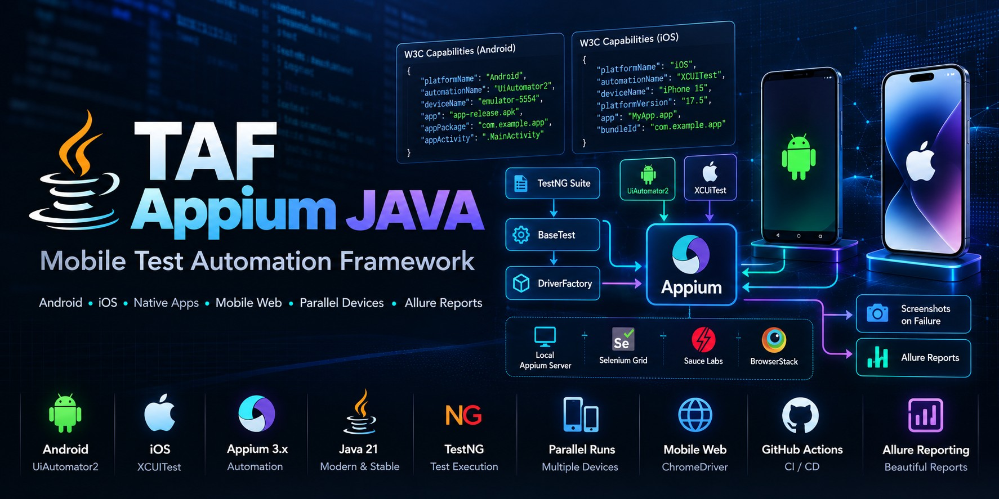
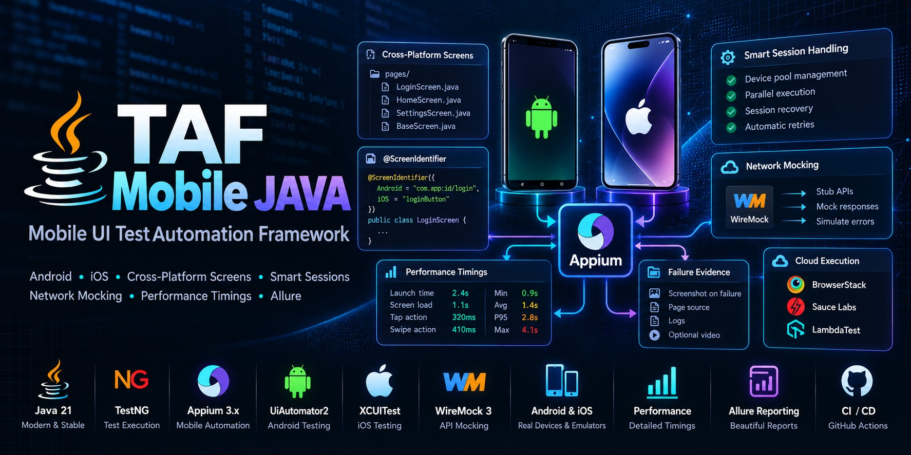
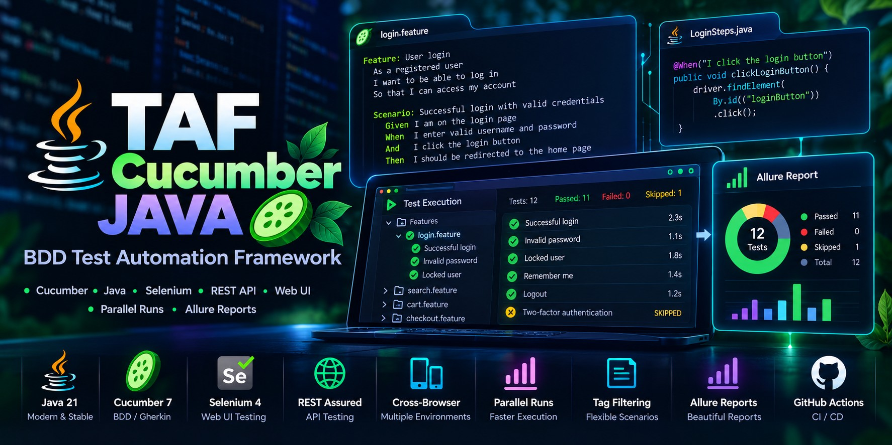
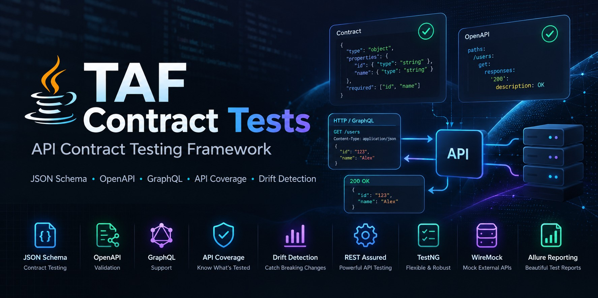
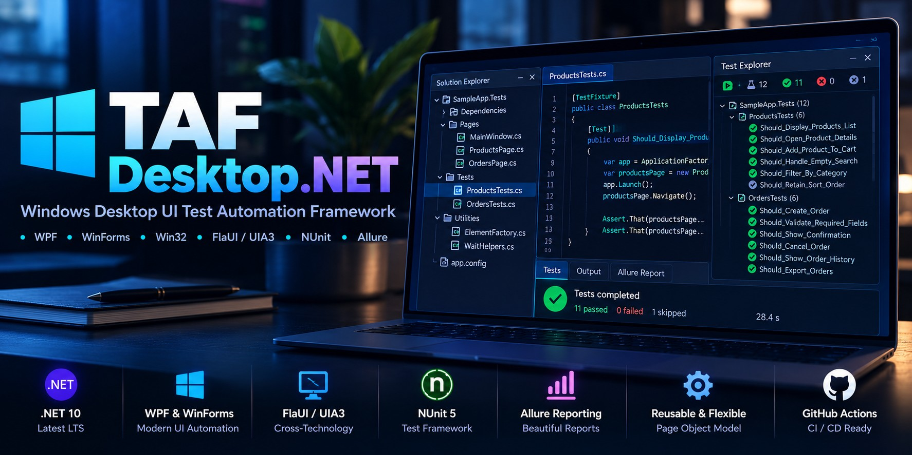
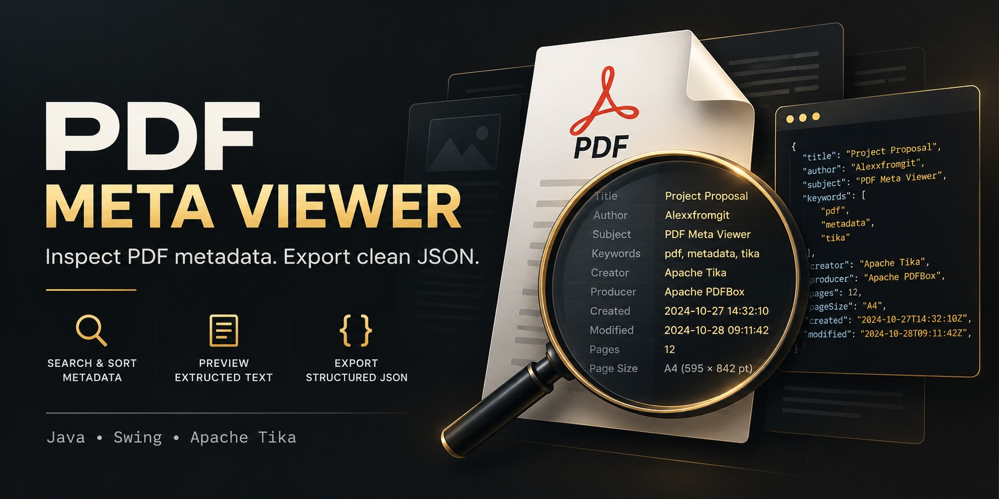
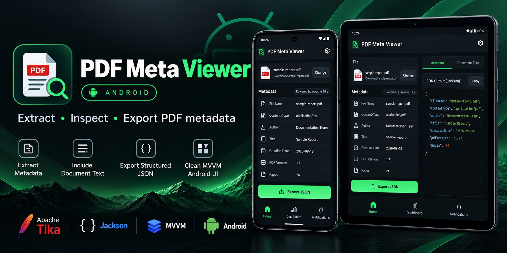
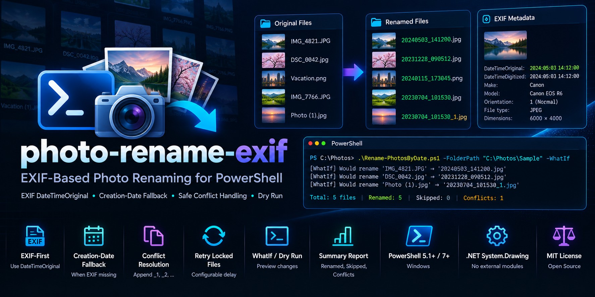
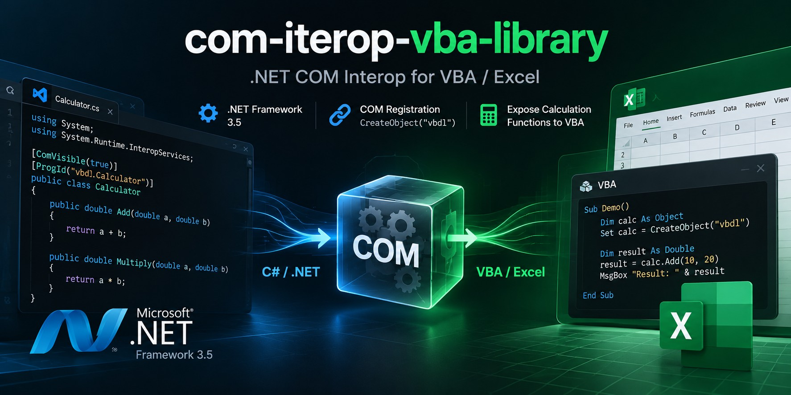

<!-- ╔══════════════════════════════════════════════════════════════════╗ -->
<!-- ║  GITHUB PROFILE README — Alexxfromgit · Gothic / Crimson edition  ║ -->
<!-- ╚══════════════════════════════════════════════════════════════════╝ -->

<!-- ───────────────  CUSTOM ANIMATED HERO  ─────────────── -->

  

<!-- ───────────────  ANIMATED TAGLINE  ─────────────── -->

  

<!-- ───────────────  PROFILE BADGES  ─────────────── -->

  
  
  
  

<!-- ───────────────  SECTION DIVIDER  ─────────────── -->

<h2 id="about-me">&nbsp;✦&nbsp;&nbsp;About&nbsp;Me</h2>

<table>
<tr>
<td valign="top" width="62%">

<table>
<tr>
  <td><b>ROLE</b></td>
  <td><b>Software Engineer in Test</b> · Cross-platform App Developer</td>
</tr>
<tr>
  <td><b>TEST AUTOMATION</b></td>
  <td>
    
    
    
    
    
    
    
  </td>
</tr>
<tr>
  <td><b>DESKTOP APPS</b></td>
  <td>
    
    
    
    
  </td>
</tr>
<tr>
  <td><b>MOBILE APPS</b></td>
  <td>
    
    
  </td>
</tr>
<tr>
  <td><b>WEB & CLOUD</b></td>
  <td>
    
    
    
  </td>
</tr>
<tr>
  <td><b>AI AGENTS</b></td>
  <td>
    
    
    
    
     multi-agent pipelines · LLM tool servers over COM automation
  </td>
</tr>
<tr>
  <td><b>STUDYING</b></td>
  <td>AI agent architecture · Rust · cross-platform crypto (UniFFI)</td>
</tr>
<tr>
  <td><b>ASK ME ABOUT</b></td>
  <td>test framework design · .NET desktop automation · shipping one app to iOS &amp; Android</td>
</tr>
</table>

</td>
<td valign="top" width="38%" align="center">

  

<i>"Good software ships on every platform — and proves it with tests that never flake."</i>

</td>
</tr>
</table>

<!-- ───────────────  SECTION DIVIDER  ─────────────── -->

<h2 id="tech-stack">&nbsp;✦&nbsp;&nbsp;Tech&nbsp;Stack</h2>

<table align="center">
<tr>
  <td valign="top" width="50%">

<h3 id="languages">&nbsp;✦&nbsp;&nbsp;Languages</h3>

  
  
  
  
  
  
  
  
  

<h3 id="test-automation">&nbsp;✦&nbsp;&nbsp;Test Automation</h3>

  
  
  
  
  
  
  
  
  
  
  
  

<h3 id="build-delivery">&nbsp;✦&nbsp;&nbsp;Build & Delivery</h3>

  
  
  
  
  
  
  

  </td>
  <td valign="top" width="50%">

<h3 id="apps-platforms">&nbsp;✦&nbsp;&nbsp;Apps & Platforms</h3>

  
  
  
  
  
  
  
  

<h3 id="ai-agents">&nbsp;✦&nbsp;&nbsp;AI Agents</h3>

  
  
  
  
  
  
  

<h3 id="cloud-tooling">&nbsp;✦&nbsp;&nbsp;Cloud & Tooling</h3>

  
  
  
  
  
  

  </td>
</tr>
</table>

<!-- ───────────────  SECTION DIVIDER  ─────────────── -->

<h2 id="github-in-numbers">&nbsp;✦&nbsp;&nbsp;GitHub&nbsp;in&nbsp;Numbers</h2>

  
  

  
  

  

<!-- ───────────────  SECTION DIVIDER  ─────────────── -->

<h2 id="featured-projects">&nbsp;✦&nbsp;&nbsp;Featured&nbsp;Projects</h2>

<h3 id="test-automation-frameworks">&nbsp;✦&nbsp;&nbsp;Test Automation Frameworks</h3>

<table>
<tr>
  <td width="50%" align="center" valign="top">
    
     <b><a href="https://github.com/Alexxfromgit/TAF-Appium-JAVA">TAF · Appium JAVA</a></b>
     Android &amp; iOS native apps + mobile web · typed W3C capabilities · parallel devices · Allure
  </td>
  <td width="50%" align="center" valign="top">
    
     <b><a href="https://github.com/Alexxfromgit/TAF-Mobile-JAVA">TAF · Mobile JAVA</a></b>
     Cross-platform screen objects · smart sessions · network mocking · screen performance timings
  </td>
</tr>
<tr>
  <td width="50%" align="center" valign="top">
    
     <b><a href="https://github.com/Alexxfromgit/TAF-Cucumber-JAVA">TAF · Cucumber JAVA</a></b>
     BDD with Cucumber · Selenium page objects + REST clients in one suite · quarantine &amp; known issues
  </td>
  <td width="50%" align="center" valign="top">
    
     <b><a href="https://github.com/Alexxfromgit/TAF-Contract-Tests">TAF · Contract Tests</a></b>
     JSON Schema contracts · OpenAPI validation · drift detection · API coverage · GraphQL
  </td>
</tr>
<tr>
  <td colspan="2" align="center" valign="top">
    
     <b><a href="https://github.com/Alexxfromgit/TAF-Desktop-DotNet">TAF · Desktop .NET</a></b>
     Windows desktop UI automation with FlaUI · WPF, WinForms &amp; Win32 · backend mocking · Allure
  </td>
</tr>
</table>

<h3 id="desktop-mobile-tools">&nbsp;✦&nbsp;&nbsp;Desktop & Mobile Tools</h3>

<table>
<tr>
  <td width="50%" align="center" valign="top">
    
     <b><a href="https://github.com/Alexxfromgit/PDF-Meta-Viewer">PDF Meta Viewer</a></b>
     Swing desktop app that extracts PDF metadata with Apache Tika · JSON export
  </td>
  <td width="50%" align="center" valign="top">
    
     <b><a href="https://github.com/Alexxfromgit/PDF-Meta-Viewer-Android">PDF Meta Viewer · Android</a></b>
     Android app that extracts and exports PDF metadata using Apache Tika
  </td>
</tr>
<tr>
  <td colspan="2" align="center" valign="top">
    
     <b><a href="https://github.com/Alexxfromgit/photo-rename-exif">Photo Rename · EXIF</a></b>
     PowerShell script that renames photos by EXIF DateTimeOriginal, falling back to file creation date
  </td>
</tr>
</table>

<h3 id="libraries-cryptography">&nbsp;✦&nbsp;&nbsp;Libraries & Cryptography</h3>

<table>
<tr>
  <td width="50%" align="center" valign="top">
    
     <b><a href="https://github.com/Alexxfromgit/com-iterop-vba-library">COM Interop · VBA Library</a></b>
     .NET Framework 3.5 COM server exposing calculation functions to VBA / Excel macros
  </td>
  <td width="50%" align="center" valign="top">
    
     <b><a href="https://github.com/Alexxfromgit/com-visible-expose-library">COM Visible · Expose Library</a></b>
     .NET Framework 4.5 · 64-bit COM interop for VBA / Excel · early &amp; late binding
  </td>
</tr>
<tr>
  <td colspan="2" align="center" valign="top">
    
     <b><a href="https://github.com/Alexxfromgit/Epistola-Crypto">Epistola Crypto</a></b>
     Olm core for Epistola secret chats · Rust + vodozemac behind UniFFI, shared by Android &amp; iOS
  </td>
</tr>
</table>

  
<b>&nbsp;✦&nbsp;&nbsp;Earlier DevOps work &amp; more…</b>

   
  <ul>
    <li>🜂 &nbsp;<a href="https://github.com/Alexxfromgit/DevOps_Salt_formula_users"><b>Salt Formula · User Control</b></a> — centralised user management across controlled hosts with SaltStack.</li>
    <li>🜃 &nbsp;<a href="https://github.com/Alexxfromgit/DevOps_Bash_Script_For_SysInfo_Collection"><b>SysInfo Collector</b></a> — hardware, OS, and network interface details in one readable report.</li>
    <li>🜄 &nbsp;<a href="https://github.com/Alexxfromgit/DevOps_Backup_With_Bash_Script"><b>Bash Backup Utility</b></a> — lightweight, schedulable, dependency-free backups in pure Bash.</li>
    <li>🜁 &nbsp;<a href="https://github.com/Alexxfromgit/DevOps_Deploy_an_infrastructure_of_2_VMs"><b>Two-VM Infrastructure</b></a> — automated deployment with <code>libvirt</code>, <code>virt-install</code>, and <code>cloud-init</code>.</li>
    <li>🜔 &nbsp;<a href="https://github.com/Alexxfromgit/DevOps_Creating_a_topology_from_2x_VM"><b>VM Topology Builder</b></a> — bootstrapping a two-VM topology from scratch.</li>
    <li>🜚 &nbsp;<a href="https://github.com/Alexxfromgit/DevOps_Poor_Configuration_Management"><b>Poor Config Management</b> (Anti-pattern Lab)</a> — a teaching repo showing what <i>not</i> to do.</li>
    <li>📜 &nbsp;Browse all  → <a href="https://github.com/Alexxfromgit?tab=repositories">github.com/Alexxfromgit?tab=repositories</a></li>
  </ul>

<!-- ───────────────  SECTION DIVIDER  ─────────────── -->

<h2 id="thought-of-the-day">&nbsp;✦&nbsp;&nbsp;Thought&nbsp;of&nbsp;the&nbsp;Day</h2>

  

 

<!-- ───────────────  FOOTER  ─────────────── -->

  

  <i>⭐ if any of my repos helped you, a star is always appreciated ⭐</i>

